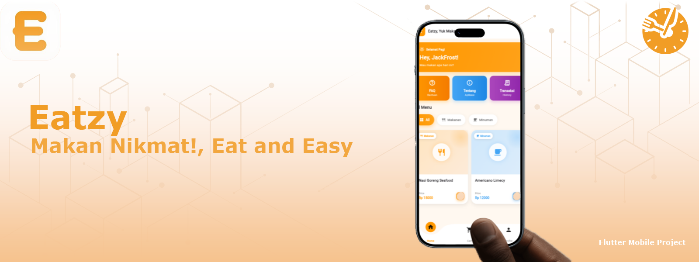
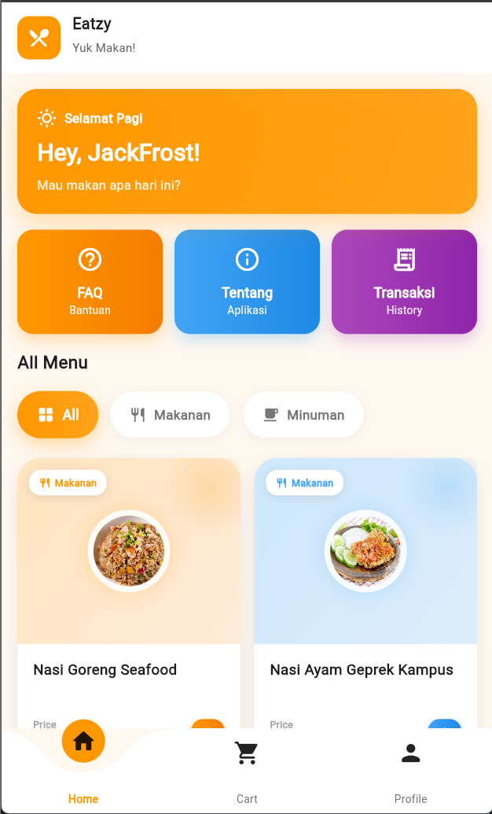
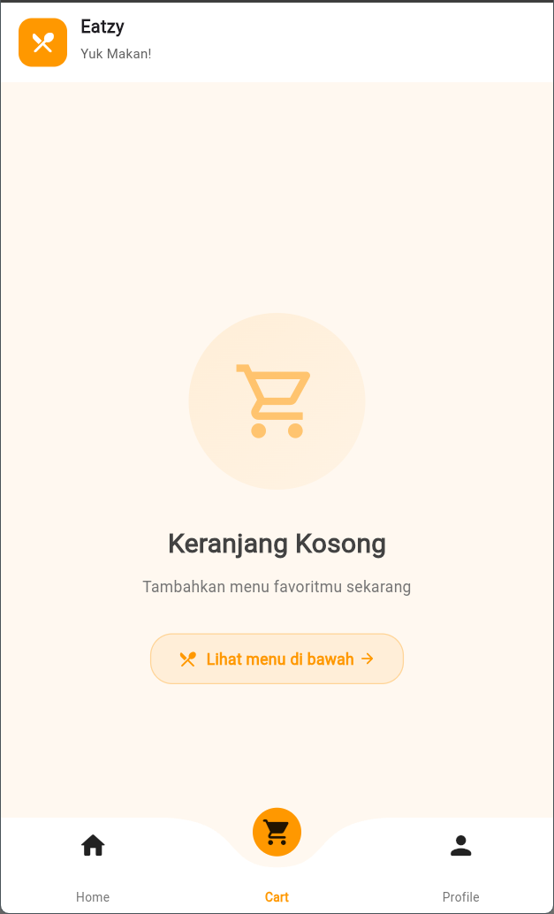
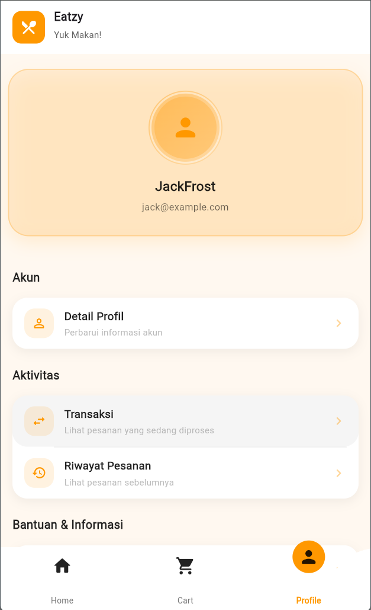
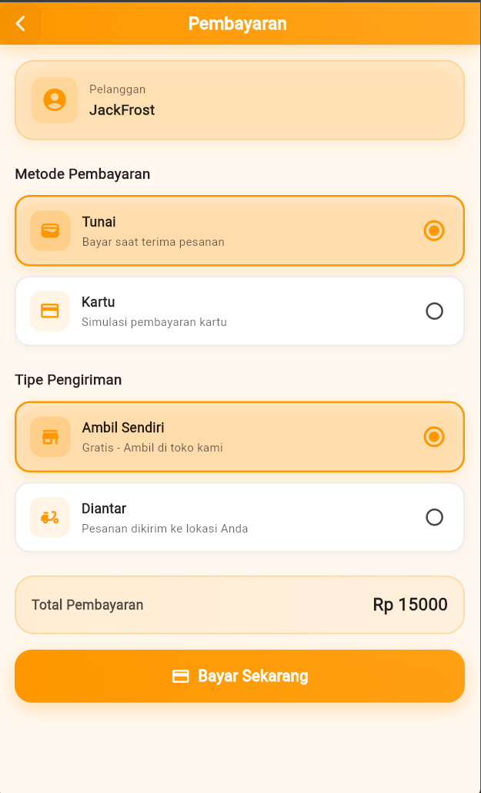
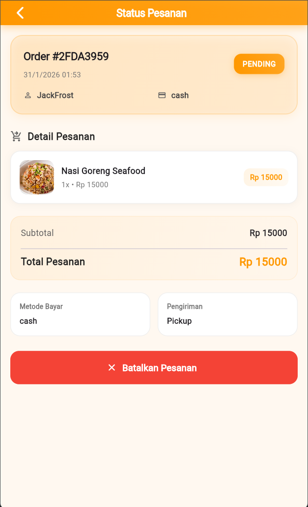
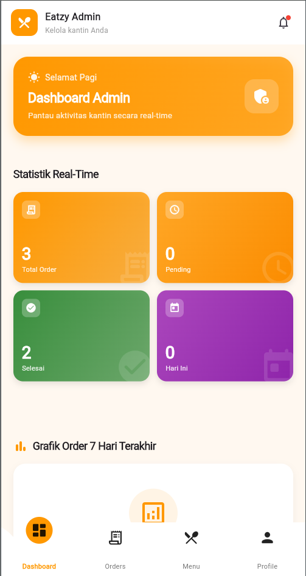
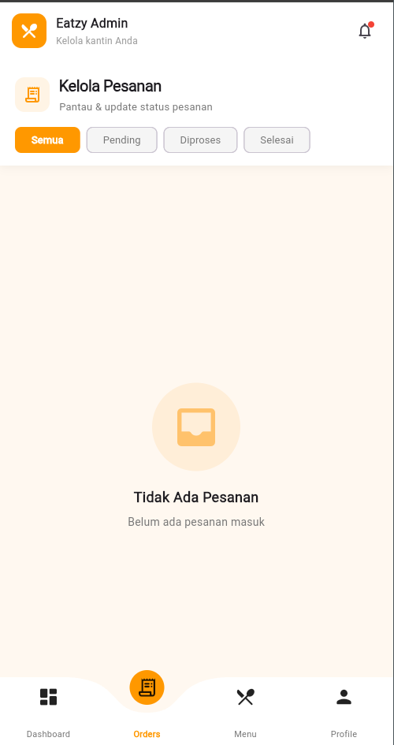
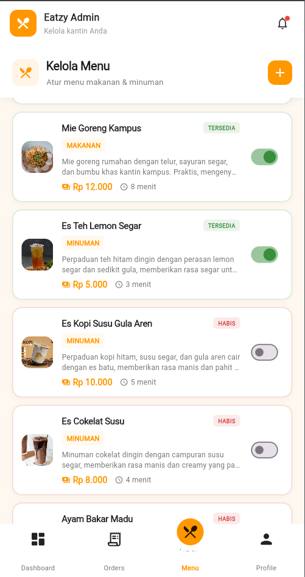
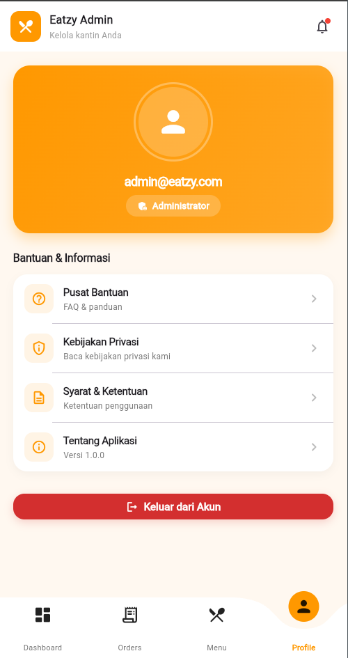

<p align="center">
  
</p>
<<p align="center">
  
  
  
  
  
  
  
</p>


<h1 align="center">🍽️ Eatzy</h1>

<p align="center">
  <b>Eatzy, Yuk Makan!</b><br>
  Aplikasi pemesanan makanan Kantin kampus berbasis Flutter
</p>

---

## 📌 Tentang Eatzy

**Eatzy** berangkat dari realita kehidupan kampus yang serba cepat. Jadwal kuliah yang padat, waktu istirahat yang terbatas, dan antrean panjang di kantin sering membuat urusan makan jadi kurang praktis. Di tengah aktivitas yang terus berjalan, mahasiswa tetap membutuhkan solusi sederhana agar bisa makan tepat waktu tanpa harus mengorbankan banyak waktu.

Lewat Eatzy, pengguna dapat dengan mudah melihat menu dari kantin atau tenant makanan di sekitar kampus, memilih makanan sesuai selera, lalu melakukan pemesanan langsung melalui smartphone. Dengan sistem pemesanan ini, makanan dapat disiapkan lebih dulu dan diambil sesuai waktu yang diinginkan, tanpa perlu terburu-buru mengantre.

Aplikasi ini dirancang dengan tampilan yang ringan, ramah pengguna, dan mudah dipahami agar nyaman digunakan di sela-sela aktivitas kampus.

---

## 🎯 Tujuan Aplikasi

- ⏱️ Menghemat waktu mahasiswa saat membeli makanan  
- 🚶‍♂️ Mengurangi antrean di kantin kampus  
- 📱 Memberikan pengalaman pemesanan yang simpel dan efisien  
- 🎓 Menjadi studi kasus nyata pengembangan aplikasi mobile  

Eatzy tidak dibuat sebagai aplikasi delivery berskala besar. Fokus utama aplikasi ini adalah pemesanan makanan di area kampus dengan alur yang sederhana dan efisien.

---

## 🛠️ Tech Stack

- Flutter  
- Dart  
- Material Design  
- REST API / Supabase / Firebase (opsional)  

---

## 📱 Fitur Utama

- 📋 Melihat menu makanan kantin atau tenant  
- 🍜 Detail menu dan harga  
- ⏰ Pemilihan waktu pengambilan (pick-up time)  
- 🛒 Pemesanan makanan langsung dari aplikasi  
- 🎨 Antarmuka ringan dan user-friendly  

---

## 📸 Screenshots Aplikasi

Berikut adalah preview antarmuka utama aplikasi **Eatzy** yang dibagi menjadi dua peran pengguna, yaitu **User** dan **Admin**.

---

### 👤 User Preview
<p align="center">
  
  
  
</p>

<p align="center">
  
  
</p>

---

### 🧑‍💼 Admin Preview
<p align="center">
  
  
  
  
</p>

---

### ℹ️ Keterangan
- Screenshot disimpan pada folder `screenshots/`
- Gambar menampilkan alur utama penggunaan aplikasi
- UI dapat berubah sesuai proses pengembangan


---

## 🚀 Instalasi & Menjalankan Project

```bash
git clone https://github.com/username/eatzy.git
cd eatzy
flutter pub get
flutter run
```
---

## 📦 Download Release APK

Aplikasi **Eatzy** tersedia dalam bentuk file **APK (Android)** yang dapat diunduh dan diinstal langsung tanpa perlu menjalankan source code.

### 🔽 Download APK
- **Versi** : v1.0 (Release)
- **Platform** : Android
- **Minimum Android** : Android 8.0 (Oreo)
- **Arsitektur** : arm64-v8a

👉 **Link Download:**  
[Download Eatzy APK](https://github.com/jck-cysec/UAS-Mobile-Programming-2-Project-Eatzy/blob/2195633b6d4b00c310a706bd0f094327c389cf1a/Eatzy-Release.apk)

---

### 📲 Cara Instal APK
1. Unduh file APK melalui link di atas  
2. Buka file APK di perangkat Android  
3. Aktifkan izin **Install from Unknown Sources** jika diminta  
4. Lanjutkan proses instalasi  
5. Aplikasi siap digunakan 🎉

---

### ⚠️ Catatan
- APK ini merupakan **hasil build release** untuk keperluan akademik
- Aplikasi tidak tersedia di Google Play Store
- Jika terjadi kendala login atau data, pastikan konfigurasi Supabase aktif

---

### 🛠️ Build APK Manual (Opsional)
Jika ingin membangun APK sendiri dari source code:

```bash
flutter build apk --release
```

---

## 📡 API — Postman Collection

Kami menyertakan contoh collection Postman yang sesuai dengan endpoint REST Supabase yang dipakai dalam proyek ini. File collection tersedia di repository: [eatzy_postman_collection.json](eatzy_postman_collection.json)

Petunjuk singkat:
- Ganti `<project-ref>` dengan referensi proyek Supabase Anda (lihat pada Supabase project settings).
- Ganti `<SUPABASE_KEY>` dengan `anon` atau `service_role` key sesuai kebutuhan (jangan commit service_role ke repo publik).
- Jika ingin menggunakan curl / header manual, sertakan header berikut pada setiap request:

```bash
HEADER_APIBEARER="apikey: <SUPABASE_KEY>"
AUTH_BEARER="Authorization: Bearer <SUPABASE_KEY>"
CONTENT_TYPE="Content-Type: application/json"

curl -H "$HEADER_APIBEARER" -H "$AUTH_BEARER" -H "$CONTENT_TYPE" \
  https://<project-ref>.supabase.co/rest/v1/orders
```

Beberapa endpoint contoh disertakan di collection (Create Order, Get User Orders, Cancel Order, Get Admin Orders, Update Order Status, Recover Recent Order).


## 📂 Struktur Folder (Project)

```text
lib/
├── main.dart
├── core/
│   ├── config/          # api clients, env and configuration (e.g. api.dart)
│   ├── constants/       # colors, sizes, strings
│   └── utils/           # helpers and small utilities
├── data/
│   ├── models/          # data models (OrderModel, etc.)
│   ├── services/        # network / supabase services
│   └── repositories/    # optional: repository adapters
├── features/
│   ├── user/            # user flows (cart, payment_page, profile)
│   ├── admin/           # admin pages (admin_orders_page, pending_orders_page)
│   └── shared/          # shared feature widgets
├── routes/              # route definitions
├── state/               # providers / app state management
└── widgets/             # shared UI widgets

assets/
├── images/
│   └── logo/
└── fonts/

android/
ios/
linux/
macos/
windows/

build/
test/

Note: struktur di atas disesuaikan dengan kode di project ini — terutama folder `lib/core`, `lib/data`, dan `lib/features` yang sudah ada.
```

---

## 🎓 Keterangan Akademik

Proyek **Eatzy** dikembangkan sebagai bagian dari pemenuhan **Ujian Akhir Semester (UAS)** pada mata kuliah **Mobile Programming 2**.

**Detail Akademik:**
- Dosen Pengampu : Muhammad Ikhwan Fathulloh, S.Kom.
- Mata Kuliah : Mobile Programming 2
- Nama : Haidir Mirza Ahmad Zacky
- NIM : 23552011072  
- Semester : 5  
- Program Studi : Teknik Informatika  
- Perguruan Tinggi : Universitas Teknologi Bandung  

---

## 📄 Lisensi

Project ini menggunakan lisensi **MIT** dan ditujukan untuk keperluan pembelajaran.

<p align="center">
  Made with ❤️ using Flutter
</p>
